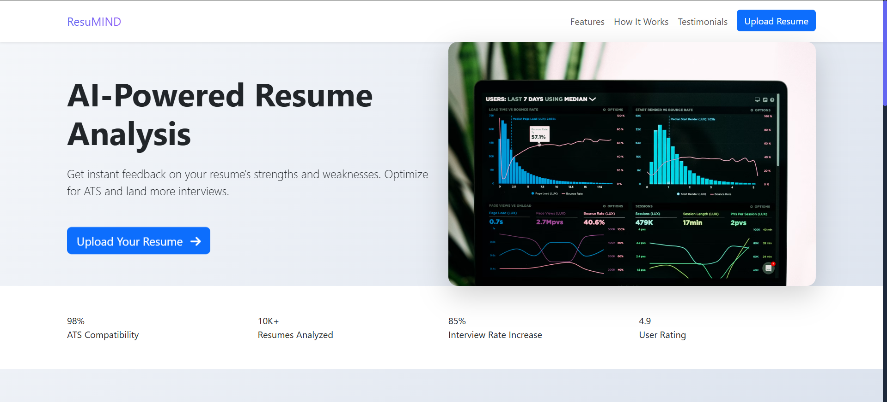

# 📄 ResuMIND - AI-Powered Resume Analysis


## 🚀 Overview

ResuMIND is an AI-powered resume analysis tool that helps job seekers optimize their resumes for better success in their job search. Using advanced natural language processing and the Gemini AI API, ResuMIND provides detailed insights and recommendations for resume improvement.

## ✨ Features

- 📊 Comprehensive resume analysis
- 🎯 ATS compatibility checking
- 🔍 Job description matching
- 💡 Smart recommendations
- 📈 Skills gap analysis
- 🛠️ Technical skills evaluation
- 📝 Content optimization suggestions

## 🛠️ Tech Stack

-  Python
-  Flask
-  Bootstrap
-  Google Gemini AI

## 🚦 Getting Started

1. **Clone the repository**
```bash
git clone https://github.com/yourusername/resumind.git
cd resumind
```

2. **Set up virtual environment**
```bash
python -m venv venv
source venv/bin/activate  # On Windows: venv\Scripts\activate
```

3. **Install dependencies**
```bash
pip install -r requirements.txt
```

4. **Set up environment variables**
```bash
# Create .env file and add your Gemini API key
GMINI_API_KEY=your_api_key_here
```

5. **Run the application**
```bash
python code/app.py
```

## 📱 Screenshots
code
<div align="center">

### Landing Page



*Modern and intuitive landing page with key features highlight*

### Resume Upload

*Simple and secure resume upload interface*

### Analysis Results

*Detailed AI-powered resume analysis with recommendations*

### Work Experience

*Comprehensive skills analysis and Work Experience visualization*

</div>

## 🔒 Privacy & Security

- All resume data is processed securely
- No personal information is stored permanently
- SSL encryption for data transmission
- Compliance with data protection regulations

## 🤝 Contributing

Contributions are welcome! Please feel free to submit a Pull Request.

## 📝 License

This project is licensed under the MIT License - see the [LICENSE](LICENSE) file for details.

## 📞 Contact

Created by [@Jkotwal01](https://github.com/Jkotwal01) - feel free to contact me!

[](https://www.linkedin.com/in/jay-kotwal-25322b2b7/)
[](https://github.com/Jkotwal01)

---
<div align="center">
Made with ❤️ by Jay Kotwal
</div>
